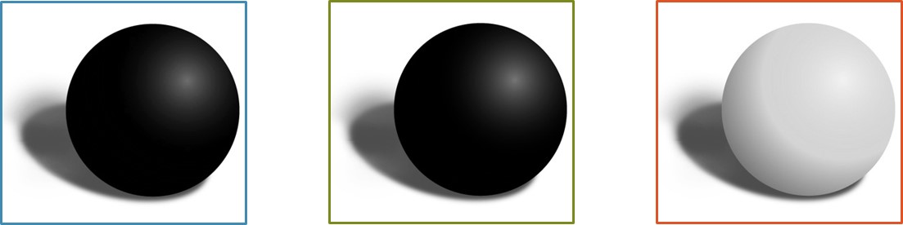
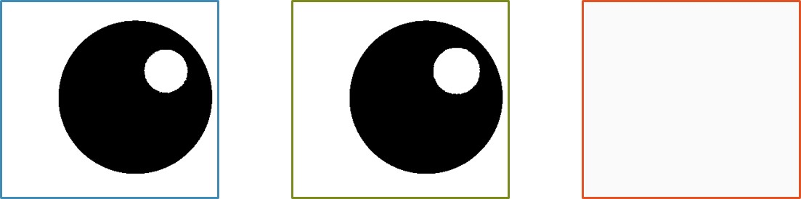
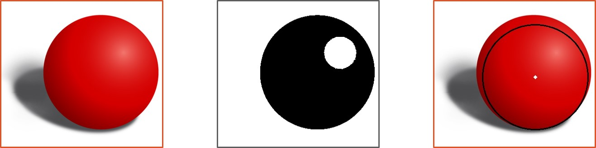

# Automation1062_Task3

## Task requests
- Determine object color.
- Locate object.
- Locate object center.

## Hints
(i)  There are lots of knobs to play around with for these functions...  
(ii) The circle-marking part is provided in the code so let's not worry about it. :)  

### Color split
  
Channel colors are blue, green, and red, from the left respectively.  

### Color thresholding
  
Channel colors are blue, green, and red, from the left respectively.  

### Hough circles
  
  
